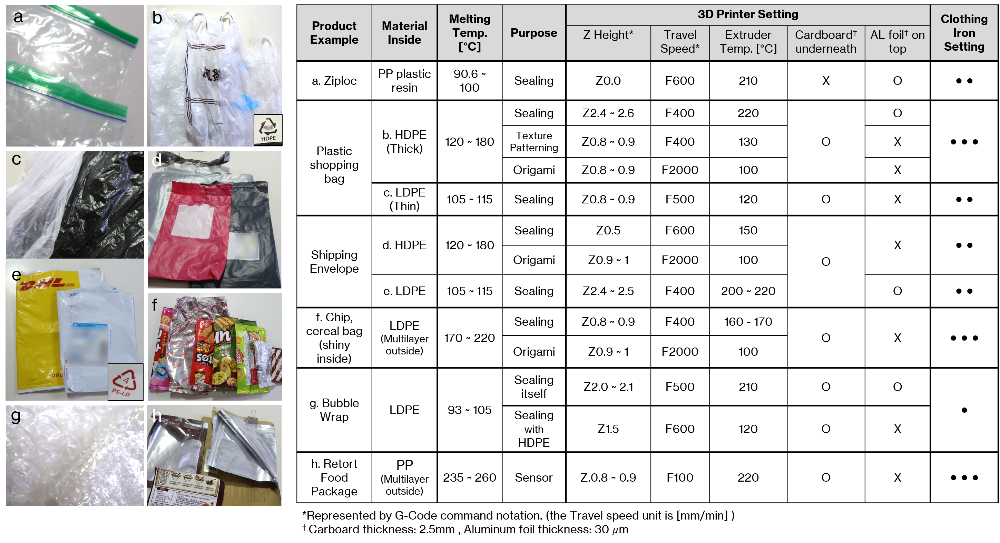

This section helps you determine the right machine setting for your application, depending on the material you choose for prototyping. Additionally, it provides snippets of code for you to enhance your .GCODE file with, so that your 3D printer can perform various functions required for inflatable prototyping.

## Pick your material

Adjust your settings according to what material you would like to seal. You can determine the right settings based on the chart below developed as part of the <a href="https://www.media.mit.edu/projects/therms-up/overview/#:~:text=Therms%2DUp!%20is%20a%20DIY,that%20easily%20found%20at%20home." target="_blank"><strong>Therms-Up!</strong></a> project. Some materials can be sealed more easily by placing a cardboard underneath or an aluminium foil on top of it. The following snippets of code were developed for sealing metalised film from crisps packets placed on top of a 2mm thick piece of cardboard.


## Seal top two layers

These settings allow you to seal only the top two layers of your design and not any layers underneath those. The seal achieved using these settings is slightly less strong than the one described in the chart. This is due to the relatively lower sealing temperature to avoid sealing more than two layers. As a result, in order to strengthen the seal, it is helpful to introduce multiple seams into the design by offsetting the seams.

```

```

## Pierce hole into top two layers

This code snippet allows you to pierce a hole through two layers of plastic sheets into your prototype. This can be useul for creating perforations and also for connecting multiple air bladders together.

```

```

## Sealing and cutting

You can use these settings to not only seal multiple layers of plastic sheets together, but also cut through the material by melting it.

```

```

## New layer

You can insert this section of code into your .GCODE file where you require the 3D printer to load a new layer of plastic sheet on top of the prototype. This code is only functional if the 3D printed add-ons available from the <strong>Tools</strong> section are attached to the 3D printer.

```
G0 Z10
G0 X0 Y30
G0 Z1

G1 X85 Y30 F400
G1 X85 Y220 F600
G1 X0 Y220 F600

G0 Z10
```
